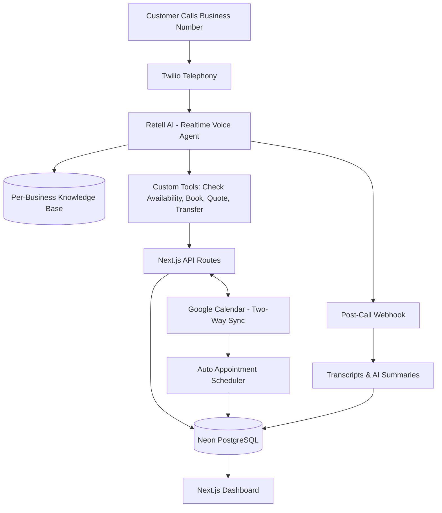
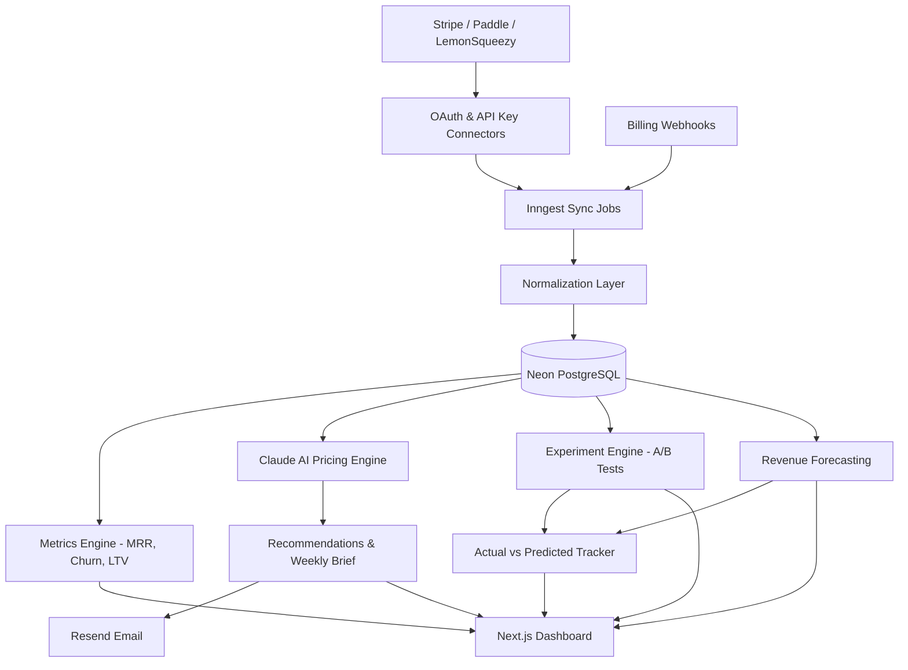

<div align="center">
<!-- HEADER -->

</div> 

<!-- INTRO -->
<p align="center"> 
  <a href="https://github.com/merickarpat"> 
     
  </a> 
</p>

---

## 🚀 What I'm Shipping

### 📞 Heyfield — AI Voice Receptionist for Home Service Businesses
<p>
  
  
</p>

<table>
<tr>
<td width="50%" valign="top">
  
```typescript
const heyfield = {
  problem: "Home service businesses miss calls = lost jobs",
  solution: "24/7 AI voice agent that books jobs and captures leads",
  tech: [
    "Next.js 16 (App Router, React 19)",
    "Neon PostgreSQL + Drizzle ORM",
    "Clerk (multi-tenant auth)",
    "Retell AI (realtime voice agent)",
    "Twilio + Google Calendar + Stripe"
  ],
  status: "Live with home service operators"
}
```

</td>
<td width="50%" valign="top">
  
**What makes it special:**

A production AI receptionist purpose-built for plumbers, HVAC, electricians and field service crews:

- Realtime voice agent powered by **Retell AI** with custom tools  
- **Auto appointment scheduling** — agent finds open slots and books on the call  
- **Two-way Google Calendar sync** — real-time availability, no double-booking  
- Per-business knowledge base: pricing, service area, hours, recurring jobs  
- Multi-tenant SaaS with call transcripts, summaries and CRM-ready handoffs
  
</td>
</tr>
</table>
  

<h2 align="center">⏬ Heyfield Architecture ⏬</h2>



---

### 📈 RevTune — AI Pricing Engine for SaaS
<p> 
   
  
</p>

<table>
<tr>
<td width="50%" valign="top">
  
```typescript
const revtune = {
  problem: "30-50% of SaaS companies are underpriced",
  solution: "Connect Stripe. Get AI pricing recommendations. Grow MRR.",
  tech: [
    "Next.js 16 (App Router, React 19)",
    "Neon PostgreSQL + Drizzle ORM",
    "Clerk + Stripe Connect (OAuth)",
    "Inngest (sync + AI pipelines)",
    "Claude API + Vercel AI SDK"
  ],
  status: "Live — Stripe / Paddle / LemonSqueezy"
}
```

</td>
<td width="50%" valign="top">

**What makes it special:**

An AI pricing intelligence platform for SaaS founders and indie hackers:

- One-click Stripe Connect; Paddle and LemonSqueezy via API key
- AI recommendations: price sensitivity, geo pricing, plan structure
- **Experiment engine** — A/B pricing tests with statistical significance
- **Revenue forecasting** — predicted MRR impact, actual vs predicted tracker
- Weekly AI Brief email — the single most impactful pricing action

</td>
</tr>
</table>
  
<h2 align="center">⏬ RevTune Architecture ⏬</h2>



---

## 🧠 Tech Arsenal
<p align="left"> 
   
</p>

### Strong Focus Areas
- **End-to-end TypeScript systems** — Next.js 16, React 19, strict TS
- **Multi-tenant SaaS architecture** — Clerk orgs, scoped data, billing
- **AI product engineering** — Retell AI voice agents, Claude API, RAG
- **Postgres at scale** — Drizzle ORM, schema design, migrations on Neon
- **Async pipelines** — Inngest jobs, webhooks, cron, retries

---

## 📊 Real Impact

<div align="center">

| Metric | Value |
|--------|-------|
| 🚀 **Production SaaS Shipped** | 2 (Heyfield + RevTune) |
| 📞 **Voice AI Calls Handled** | 24/7 via Retell AI for home service operators |
| 📅 **Appointments Booked** | Auto-scheduled with two-way Google Calendar sync |
| 💳 **Billing Platforms Integrated** | Stripe, Paddle, LemonSqueezy |
| 📈 **Pricing Experiments Supported** | A/B tests, forecasts, impact tracking |
| ⚡ **API Response Time** | <200ms (p95) |

</div>

---

## 🏗️ Architecture Philosophy

> **"Build for scale from day one, optimize for developer experience always."**

- **Type-safe everything** — TypeScript end-to-end, Zod validation, Drizzle types
- **AI-first product thinking** — voice agents, structured LLM output, evals
- **Observability built-in** — Sentry, structured logging, PostHog funnels
- **Zero-downtime deploys** — Vercel CI/CD, gradual rollouts
- **Cost-conscious scaling** — cache aggressively, batch AI calls, edge where it matters

---

## 💡 Side Interests

- **Realtime voice AI** — latency budgets, barge-in, tool-use during calls
- **Pricing & monetization** — willingness-to-pay, geo pricing, packaging
- **Developer tools** — internal CLIs, codegen, AI-assisted workflows
- **Vector search & RAG** — pgvector indexes for sub-second retrieval

---

## 📫 Let's Build Something

<div align="center">

[](mailto:meric.karpat@icloud.com)
[](https://linkedin.com/in/meric-karpat)
[](https://www.google.com/maps/place/Izmir)

### Open to:
🤝 Technical co-founders for AI/SaaS projects    
💼 Contract work or consulting on complex backend systems  
🎙️ Speaking about SaaS architecture & AI integration  
☕ Coffee chats about startup ideas

</div>

---

<div align="center">

## "Ship fast, iterate faster, never stop learning."

⭐ If you find my work interesting, feel free to reach out or star my public repos!

</div> <!-- FOOTER --> 
  
