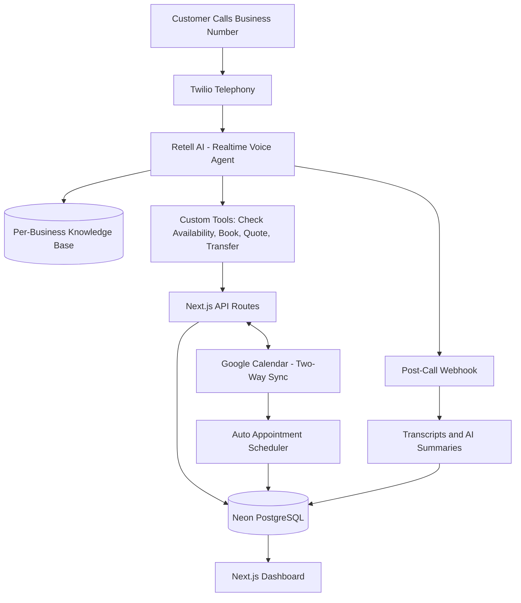
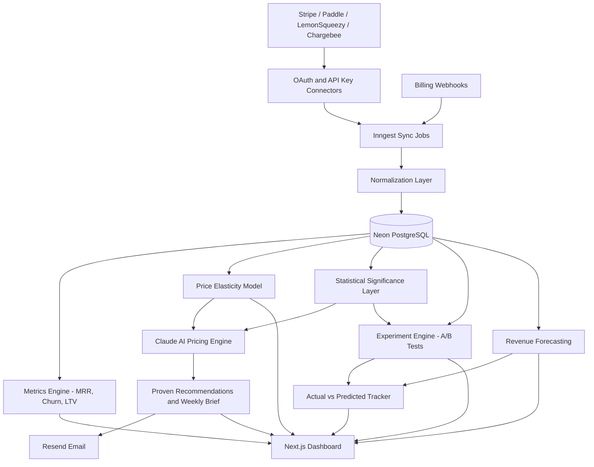

<div align="center">
<!-- HEADER -->

</div>

<!-- INTRO -->
<p align="center">
  <a href="https://github.com/merickarpat">
    
  </a>
</p>

---

## 🚀 What I'm Shipping

###  Heyfield — AI Voice Receptionist for Home Service Businesses

<p>
  <a href="https://heyfield.app"></a>
  
  
</p>

🔗 **Live at [heyfield.app](https://heyfield.app)**

A production AI receptionist purpose-built for plumbers, HVAC, electricians and field service crews. 24/7 voice agent that books jobs, qualifies leads and never lets a call go to voicemail.

**Highlights**

- Realtime voice agent powered by **Retell AI** with custom tools
- **Auto appointment scheduling** — agent finds open slots and books on the call
- **Two-way Google Calendar sync** — real-time availability, no double-booking
- Per-business knowledge base: pricing, service area, hours, recurring jobs
- Multi-tenant SaaS with call transcripts, AI summaries and CRM-ready handoffs

```typescript
const heyfield = {
  url: "https://heyfield.app",
  problem: "Home service businesses miss calls = lost jobs",
  solution: "24/7 AI voice agent that books jobs and captures leads",
  tech: [
    "Next.js 16 (App Router, React 19)",
    "Neon PostgreSQL + Drizzle ORM",
    "Clerk (multi-tenant auth)",
    "Retell AI (realtime voice agent)",
    "Twilio + Google Calendar + Stripe",
  ],
  status: "Live with home service operators",
};
```

<h4 align="center">⏬ Heyfield Architecture ⏬</h4>

<p align="center">
  
</p>

<details>
<summary>View diagram source (Mermaid)</summary>



</details>

---

###  RevTune — AI Pricing Engine for SaaS

<p>
  <a href="https://revtune.io"></a>
  
  
</p>

🔗 **Live at [revtune.io](https://revtune.io)**

An AI pricing intelligence platform for SaaS founders and indie hackers. Connect Stripe, Paddle, LemonSqueezy or Chargebee and get statistically-proven pricing recommendations — not vibes.

**Highlights**

- One-click Stripe Connect; Paddle, LemonSqueezy and **Chargebee** via API key
- **Price elasticity modeling** — data-driven sensitivity curves per plan and segment
- **Statistically-proven AI recommendations** — every suggestion backed by significance tests
- **Experiment engine** — A/B pricing tests with statistical significance & confidence intervals
- **Revenue forecasting** — predicted MRR impact, actual vs predicted tracker
- Weekly AI Brief email — the single most impactful pricing action of the week

```typescript
const revtune = {
  url: "https://revtune.io",
  problem: "30-50% of SaaS companies are underpriced",
  solution: "Connect Stripe. Get statistically-proven pricing recommendations.",
  tech: [
    "Next.js 16 (App Router, React 19)",
    "Neon PostgreSQL + Drizzle ORM",
    "Clerk + Stripe Connect (OAuth)",
    "Inngest (sync + AI pipelines)",
    "Claude API + Vercel AI SDK",
  ],
  status: "Live — Stripe / Paddle / LemonSqueezy / Chargebee",
};
```

<h4 align="center">⏬ RevTune Architecture ⏬</h4>

<p align="center">
  
</p>

<details>
<summary>View diagram source (Mermaid)</summary>



</details>

---

## 🧠 Tech Arsenal

<p align="left">
  
</p>

**Strong Focus Areas**

- **End-to-end TypeScript systems** — Next.js 16, React 19, strict TS
- **Multi-tenant SaaS architecture** — Clerk orgs, scoped data, billing
- **AI product engineering** — Retell AI voice agents, Claude API, RAG
- **Statistically-grounded ML** — elasticity modeling, significance testing, confidence intervals
- **Postgres at scale** — Drizzle ORM, schema design, migrations on Neon
- **Async pipelines** — Inngest jobs, webhooks, cron, retries

---

## 📊 Real Impact

| Metric | Value |
|--------|-------|
| 🚀 **Production SaaS Shipped** | 2 ([Heyfield](https://heyfield.app) + [RevTune](https://revtune.io)) |
| 📞 **Voice AI Calls Handled** | 24/7 via Retell AI for home service operators |
| 📅 **Appointments Booked** | Auto-scheduled with two-way Google Calendar sync |
| 💳 **Billing Platforms Integrated** | Stripe, Paddle, LemonSqueezy, Chargebee |
| 📈 **Pricing Recommendations** | Statistically-proven, elasticity-driven, A/B tested |
| ⚡ **API Response Time** | <200ms (p95) |

---

## 🏗️ Architecture Philosophy

> **"Build for scale from day one, optimize for developer experience always."**

- **Type-safe everything** — TypeScript end-to-end, Zod validation, Drizzle types
- **AI-first product thinking** — voice agents, structured LLM output, evals
- **Statistically grounded** — no advice without significance, no forecasts without confidence intervals
- **Observability built-in** — Sentry, structured logging, PostHog funnels
- **Zero-downtime deploys** — Vercel CI/CD, gradual rollouts
- **Cost-conscious scaling** — cache aggressively, batch AI calls, edge where it matters

---

## 💡 Side Interests

- **Realtime voice AI** — latency budgets, barge-in, tool-use during calls
- **Pricing & monetization** — willingness-to-pay, geo pricing, packaging
- **Developer tools** — internal CLIs, codegen, AI-assisted workflows
- **Vector search & RAG** — pgvector indexes for sub-second retrieval

---

## 📫 Let's Build Something

<p>
  <a href="mailto:meric.karpat@icloud.com"></a>
  <a href="https://linkedin.com/in/meric-karpat"></a>
  <a href="https://www.google.com/maps/place/Izmir"></a>
</p>

**Open to:**

- 🤝 Technical co-founders for AI/SaaS projects
- 💼 Contract work or consulting on complex backend systems
- 🎙️ Speaking about SaaS architecture & AI integration
- ☕ Coffee chats about startup ideas

---

<div align="center">

### "Ship fast, iterate faster, never stop learning."

⭐ If you find my work interesting, feel free to reach out or star my public repos!

</div>

<!-- FOOTER -->

